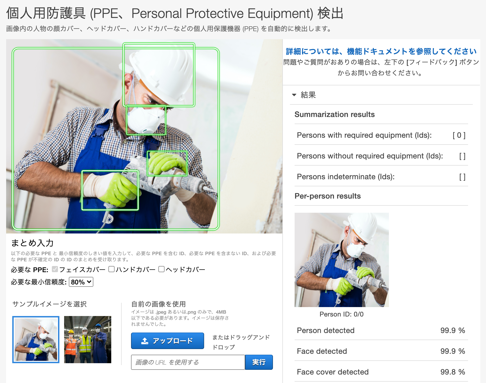

---
title: "Amazon Rekognition"
weight: 1
date: 2021-01-05
description: >
  画像や動画の分析を行うための AI サービスです。
---

## 一般的なシーン認識・物体検知を行う
画像のどこに人、車、猫などの一般的な被写体が写っているかを分析したり、写真に何が写っているのかを分析したりできます。AWS コンソールからサンプル画像やアップロードした画像を使って簡単に機能を試すことができます。

[AWS コンソールへのリンク（東京リージョン）](https://ap-northeast-1.console.aws.amazon.com/rekognition/home?region=ap-northeast-1#/label-detection)

### 参考情報

[Amazon Rekognition の開始方法](https://aws.amazon.com/jp/rekognition/getting-started/) 
Amazon Rekognition の利用を始めるためのドキュメントや、いくつかのユースケースを実現するための動画が公開されています。

---
## 独自のシーン認識・物体検知モデルを作る
Amazon Rekognition Custom Labels（カスタムラベル）という機能を使って、お客様がお持ちの画像を使って、独自のシーン認識（画像分類）や物体検知モデルをノーコードで作成いただけます。

Amazon SageMaker Ground Truth で画像のラベリングを行い、その結果を使って Amazon Rekognition Custom Labels でモデルを作成することができます。

### 参考情報
[【Nyantech ハンズオンシリーズ】機械学習を使って写真に写っている猫を見分けてみよう！](https://aws.amazon.com/jp/builders-flash/202003/sagemaker-groundtruth-cat/) 
Amazon SageMaker Ground Truth で画像のラベリングをし、Amazon Rekognition Custom Labels を使って猫のタマとミケを見分ける機械学習モデルを作る方法がハンズオン形式で説明されています。

[Amazon Rekognition Custom Labelsを利用した動物の特徴的な行動検出](https://aws.amazon.com/jp/blogs/news/detecting-playful-animal-behavior-in-videos-using-amazon-rekognition-custom-labels/) 
猫の動画を題材に、猫パンチをしているかしていないかを見分けるモデルを作っています。

---
## 顔検出と分析
画像に写っている顔を検出し、その特徴を分析する機能です。年齢、目の大きさ、眼鏡濃霧、髭の有無などの属性を取得できます。動画では、これらの顔の属性が時間と共にどう変化するかも取得でき、例えば役者が示す感情のタイムラインを作成することができます。

### 顔の比較
顔の比較の機能を使うことで、2枚の写真に写っている人物がどれくらい似ているかを知ることができます。AWS コンソールからサンプル画像を使ったり、画像をアップロードしたりしてこの機能を簡単に試すことができます。

[AWS コンソールへのリンク（東京リージョン）](https://ap-northeast-1.console.aws.amazon.com/rekognition/home?region=ap-northeast-1#/face-comparison)

### 参考情報
[顔検出機能で取得できる情報（開発者ガイド）](https://docs.aws.amazon.com/ja_jp/rekognition/latest/dg/faces-detect-images.html#detectfaces-response) 
顔検出機能の API (DetectFaces) を使って取得できる情報について記載されています。

[画像間の顔の比較（開発者ガイド）](https://docs.aws.amazon.com/ja_jp/rekognition/latest/dg/faces-comparefaces.html) 
顔の比較の機能の使い方が記載されています。

---
## 顔検索と検証
顔画像の特徴を記録するレポジトリを作成し、写真やビデオ中の人物をリポジトリに登録された人物と照合することができます。

### 参考情報
[東海理研株式会社様 AWS/Rekognitionを活用した宿泊施設向け入退室管理システム構築事例](https://aws.amazon.com/jp/blogs/news/ml-images-usecase-seminar/) 
2020年9月2日に開催された「AWSの機械学習を使った画像データの業務活用セミナー」で登壇いただいたお客様事例の動画と資料を公開しています。

[Auto Check-In App（AWS ソリューションライブラリ）](https://aws.amazon.com/jp/solutions/implementations/auto-check-in-app/) 
顔の特徴を登録するリポジトリ（顔コレクション）を作成し、イベントのチェックインのための顔認証に必要な製品やサービスを自動的に構築するソリューションを公開しています。イベントチェックイン時に、イベント参加者の写真を撮影すると、このソリューションは Amazon Rekognition に顔画像を送信し、そこで事前登録された参加者の顔コレクションに照らし合わせてそれらの画像を検証します。

---
## テキスト検出
画像内のテキスト（英数字）を検出できる機能です。

AWS コンソールからサンプル画像やアップロードした画像を使って簡単に機能を試すことができます。

[AWS コンソールへのリンク（東京リージョン）](https://ap-northeast-1.console.aws.amazon.com/rekognition/home?region=ap-northeast-1#/text-detection)

### 参考情報
[スマートガレージ（AWS ブログ）](https://aws.amazon.com/jp/blogs/news/building-a-smart-garage-door-opener-with-aws-deeplens-and-amazon-rekognition/) 
Amazon Rekognition のテキスト検出機能を使って、特定のナンバープレートの車のみが使用できるガレージを実現する方法を紹介している記事です。

---
## コンテンツのモデレーション
写真に写っているものが暴力的、性的なものでないかなどを判断するための情報を取得できます。お客様は取得した情報をもとに、その写真が不適切なものかどうかを判断することができます。

自社サイトに意図しない画像がアップロードされることを防ぐために、この機能を使ってアップロード前に画像を検査するなどが考えられます。

AWS コンソールからサンプル画像やアップロードした画像を使って簡単に機能を試すことができます。

[AWS コンソールへのリンク（東京リージョン）](https://ap-northeast-1.console.aws.amazon.com/rekognition/home?region=ap-northeast-1#/image-moderation)

### 参考情報
[この機能で取得できる情報（開発者ガイド）](https://docs.aws.amazon.com/ja_jp/rekognition/latest/dg/moderation.html) 
この機能を使うことによって、どのような情報が得られるかが記載されています。

---
## 有名人の認識

入力された動画や写真をライブラリに照らし合わせ、どの有名人が写っているかを認識します。

AWS コンソールからサンプル画像やアップロードした画像を使って簡単に機能を試すことができます。

[AWS コンソールへのリンク（東京リージョン）](https://ap-northeast-1.console.aws.amazon.com/rekognition/home?region=ap-northeast-1#/celebrity-detection)

### 参考情報

[この機能で取得できる情報（開発者ガイド）](https://docs.aws.amazon.com/ja_jp/rekognition/latest/dg/celebrities-procedure-image.html) 
この機能を使うことによって、どのような情報が得られるかが記載されています。

---
## Personal Protective Equipment (PPE) の検出

写真に映っている人物がフェイスカバー (フェイスマスク)、ハンドカバー (手袋)、ヘッドカバー (ヘルメット) などの PPE を着用しているかどうか、またそれらの保護器具が、該当する身体の部分 (フェイスカバーでは鼻、ヘッドカバーでは頭、ハンドカバーでは手) を覆っているかどうかを自動的に検出します。

AWS コンソールからサンプル画像やアップロードした画像を使って簡単に機能を試すことができます。

[AWS コンソールへのリンク（東京リージョン）](https://ap-northeast-1.console.aws.amazon.com/rekognition/home?region=ap-northeast-1#/ppe)

### 参考情報

[この機能で取得できる情報（開発者ガイド）](https://docs.aws.amazon.com/ja_jp/rekognition/latest/dg/ppe-request-response.html) 
この機能を使うことによって、どのような情報が得られるかが記載されています。
